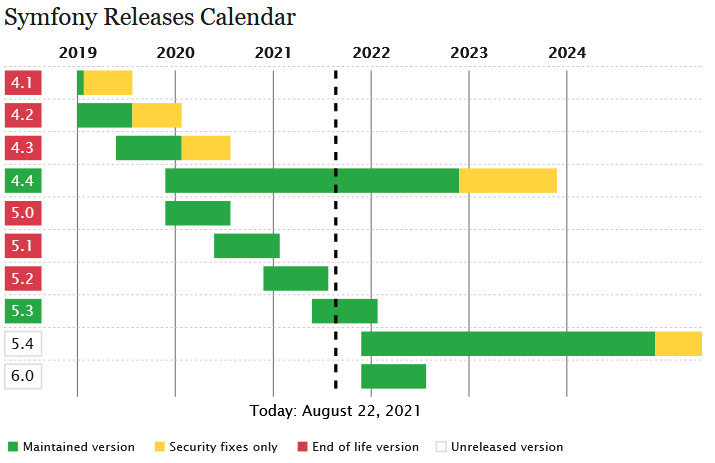

# [Symfony](https://symfony.com/)

Symfony est un ensemble de composants PHP ainsi qu'un framework MVC libre écrit en PHP. Il fournit des fonctionnalités modulables et adaptables qui permettent de faciliter et d’accélérer le développement d'un site web.

## [Le projet](https://github.com/symfony/symfony)

Le projet Symfony est constitué de pas moins de 2400 contributeurs à ce jour. Le fondateur du Framework et co-fondateur de Sensio, `Fabien Potencier` est un contributeur important.

L'agence web française `SensioLabs` est à l'origine du framework Sensio Framework. À force de toujours recréer les mêmes fonctionnalités de gestion d'utilisateurs, gestion ORM, etc., elle a développé ce framework pour ses propres besoins. Comme ces problématiques étaient souvent les mêmes pour d'autres développeurs, le code a été par la suite partagé avec la communauté des développeurs PHP.

> Le 5 septembre 2017, [Symfony passe la barre du milliard de téléchargements](https://symfony.com/blog/the-symfony-unicorn-1-billion-downloads).

## [Versions](https://symfony.com/releases)

La dernière version stable est la 5.3 mais la LTS est la version 4.4

----------

[Retour au sommaire](00_sommaire.md)
